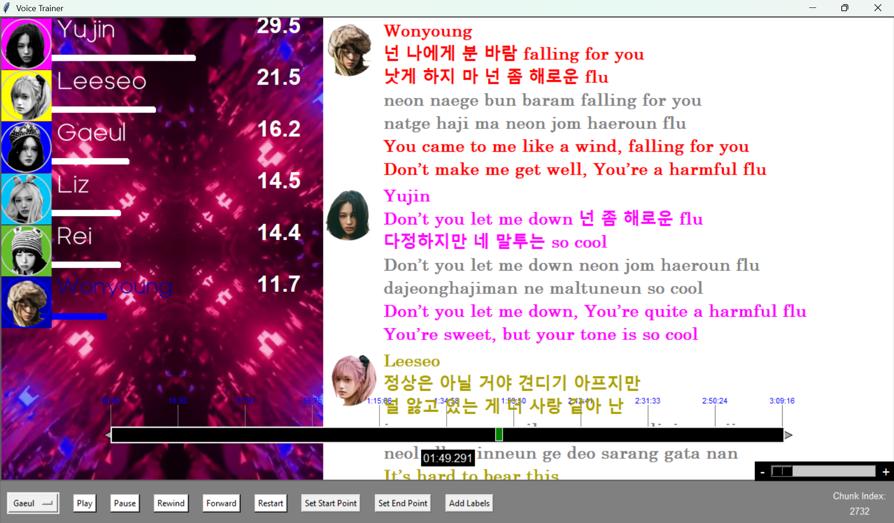

  
 <h1 align="center">🎤 K-Pop Voice Recognition</h1> 
<b>A Human-Centered Machine Learning System for Multi-Singer Vocal Identification</b>
 
     

Overview

K-pop Voice Recognition is a complete human-in-the-loop ML system that identifies which member of a K-pop group is singing at every moment in a song — including harmonies, overlaps, and rapid transitions.

This project blends:  
🎶 Audio signal processing  
🧠 Multi-label machine learning  
🎛 A fully custom annotation UI  
🧑‍💻 Research-oriented debugging & iteration  

It addresses a real research challenge: there is **no existing dataset** for multi-singer pop music, and singing behaves **very differently from speech.**

What began as a curiosity (“Who sings which line?”) became a research pipeline involving data engineering, modeling, feature design, temporal context modeling, and annotation tools that make large-scale labeling possible.

⭐ Key Features
<table> <tr><td>
🎚 Labeling UI  

Drag-and-drop markers  

Zoom slider (micro 40ms → macro 200ms+)  

Undo/redo  

Start/end point creation  

Real-time timeline display  

Member images that “light up” as they sing  

Video overlay support (MV synchronization)  

</td><td>
🧠 ML System  

Multi-head classifier:  
• presence  
• lead  
• harmony  
• ad-lib  

Multi-window temporal context  

Automatic chunk alignment  

Silence & gang-vocal detection  

Solo→mixed-stage training  

</td></tr> </table>

# Demo Visuals

<i>UI Overview</i>
 
  
 
  
 
  

# How the System Works

  
  

1. Extract isolated vocals (external tool or preprocessing)  
2. Split into 40ms audio chunks  
3. Label chunks via custom UI → JSON files  
4. Extract features (spectral, MFCC, temporal)  
5. Train model (multi-label, multi-head)  
6. Predict frame-wise singer activity  
7. Smooth predictions for temporal consistency  
8. Visualize predictions live in the UI  

**Core Ideas (High-Level)**
Multi-label classification handles overlapping voices  
Temporal context allows the model to “hear transitions”  
Human-in-the-loop ensures label quality and realistic training data  
Custom UI accelerates annotation and improves precision  

# Why This Project Is Unique

Very few projects attempt multi-singer recognition (most use speech or solo singers).
K-pop vocals include:  
- stacked harmonies  
- overlapping ad-libs  
- pitch jumps  
- variable mixing styles  

Building this required creating the dataset, building the UI, and designing the model.  
It is both a research experiment and a full engineering system.

# ⭐ Technical Skills Demonstrated
- PyTorch / TensorFlow modeling  
- Audio feature extraction (librosa)  
- Tkinter UI engineering (complex state & event handling)  
- Data labeling & dataset curation  
- Visualization and HCI design  
- Threading and real-time playback (pygame)  
- Research-level model evaluation & error analysis  
- JSON label versioning and editing  
- Multi-stage training system design

# ⭐ Installation & Quick Start
Requirements  
Python 3.9+  
pydub  
pygame  
Pillow  
librosa  
PyTorch (with cuda Compatibility)  

Setup  
git clone https://github.com/USERNAME/kpop-voice-recognition  
cd kpop-voice-recognition  
pip install -r requirements.txt  

# Launch Labeling UI
python voice_recognition_gui.py  

# Train Model (Take a look at commands.txt to see each necessary argument)
python train_kpop_singers.py

⭐ Example Annotation Workflow
<table> <tr><td>
1. Load Song

Choose MP3 + vocals-only file.

2. Mark Segments

Use Q/W to mark start/end.

3. Drag to Refine

Adjust boundaries precisely.

4. Assign Member

Select from dropdown.

</td><td>
5. Save JSON

Stores clean segment labels.

6. Train Model

Solo → mixed training pipeline.

7. Run Predictions

Watch members light up during playback.

8. Correct Errors

Improve data → retrain model.

</td></tr> </table>

# Acknowledgements & Personal Note

This project started from a simple question — “Who is singing this part?”
But it evolved into a full research system involving ML, UI design, audio analysis, and dataset creation.

Building every component myself — the UI, the labeling pipeline, the model, the visualization — taught me:

how to diagnose model failures

how to design robust ML systems

how to combine engineering and research thinking

how to work iteratively and scientifically

This project shaped my interest in robustness, reliable ML, and audio intelligence.
It reflects both curiosity and a commitment to building systems that work in real-world settings.
